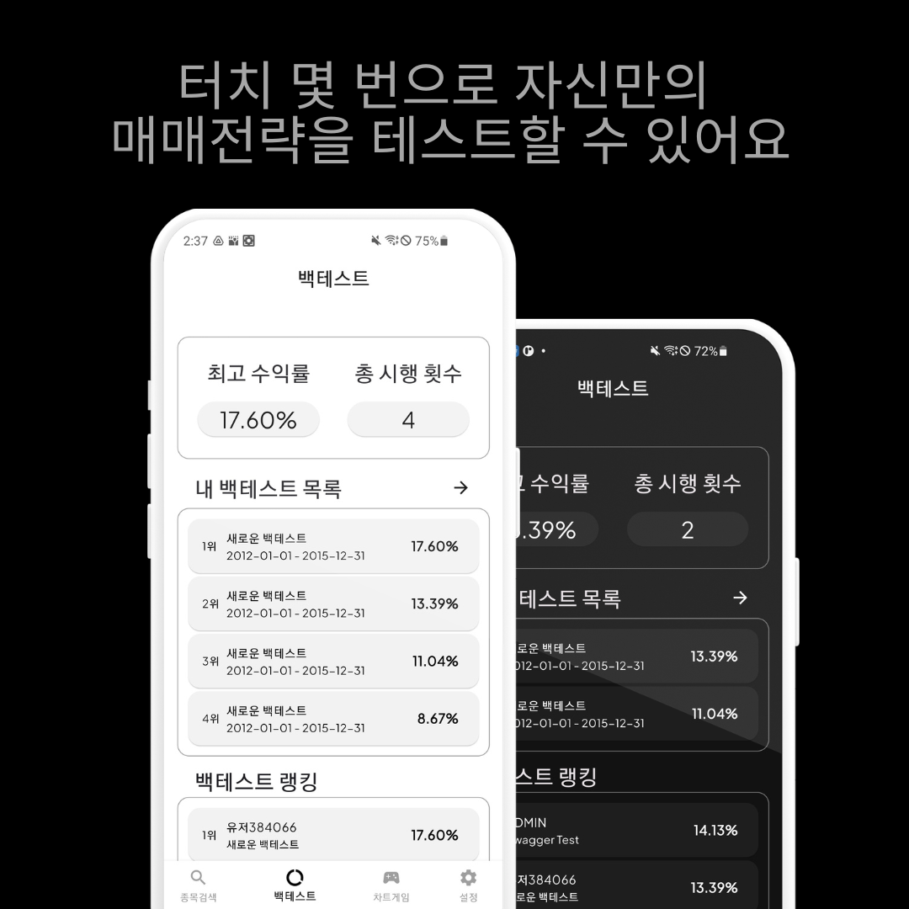
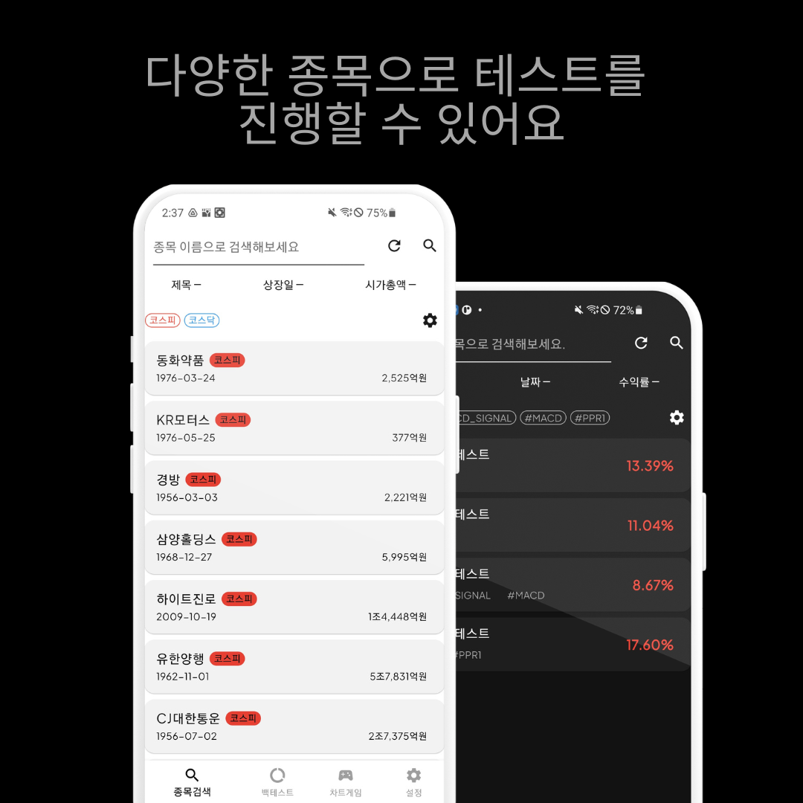
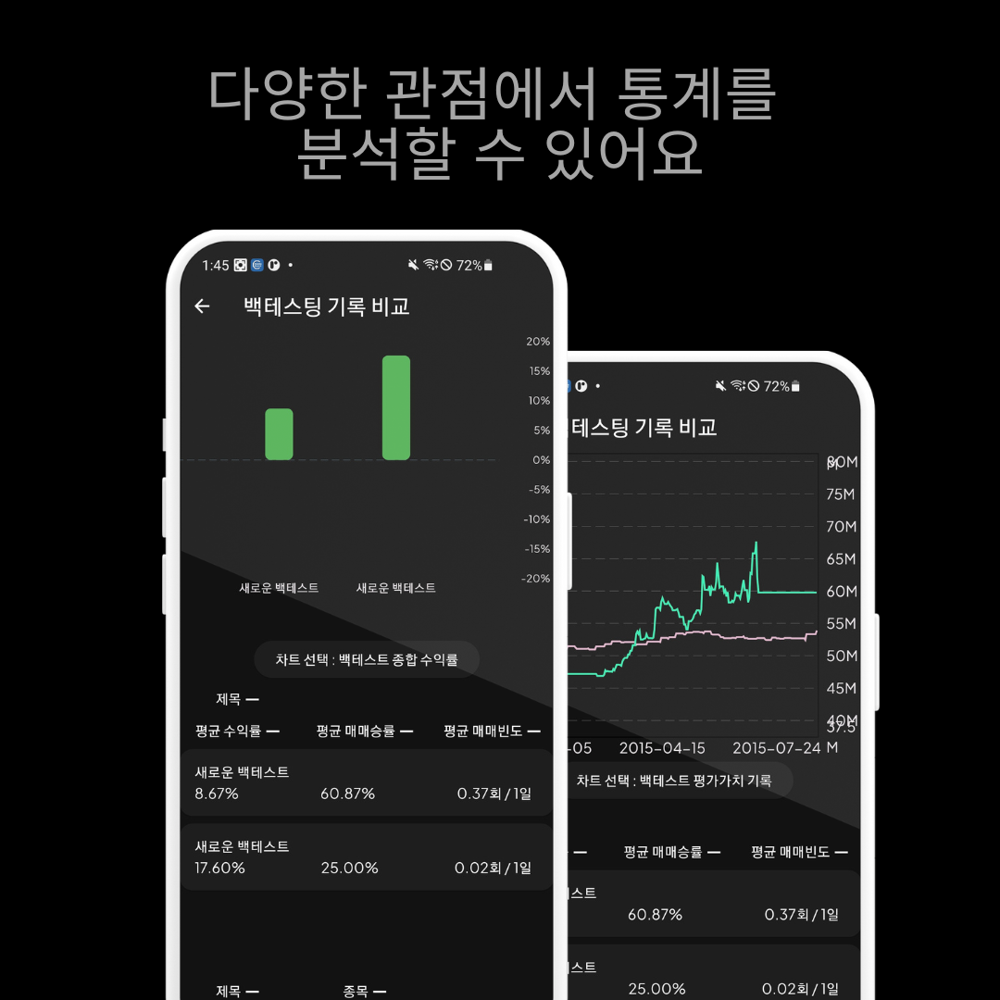
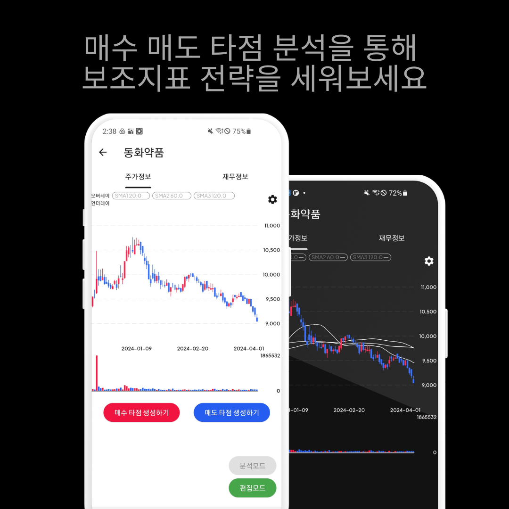
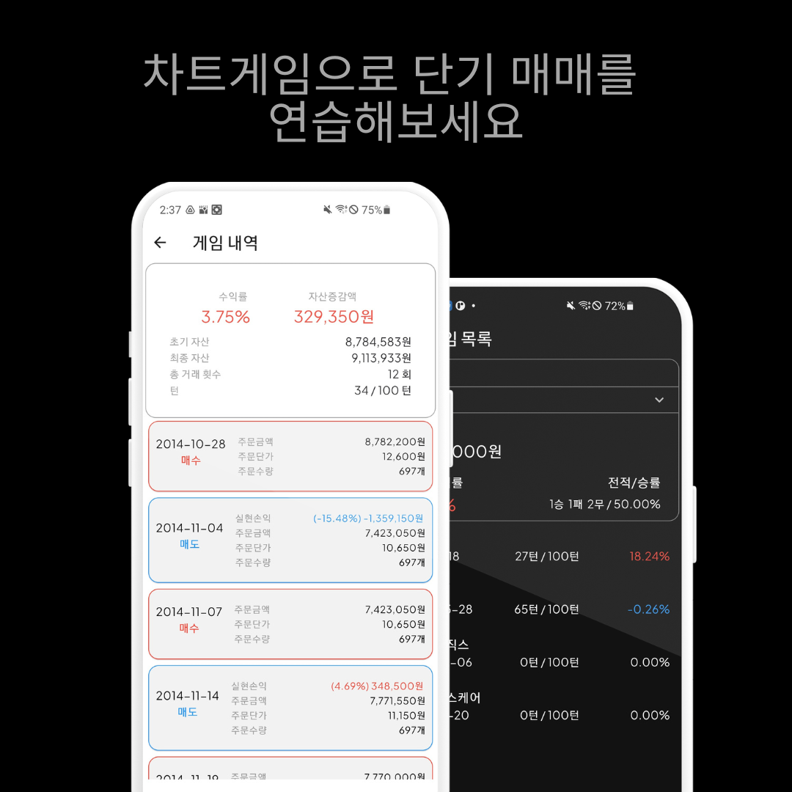
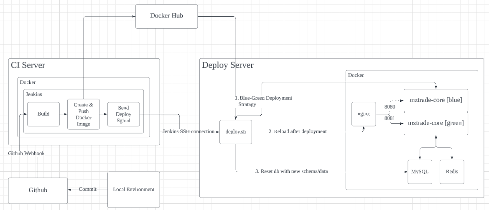

# 주식 백테스팅 어플리케이션

## 프로젝트 개요

---

<aside>
🔥 목표: 과거 주식 데이터에 사용자 설정 매매법을 토대로 시뮬레이션 후 통계 결과를 보여주는 서비스 구현하기

</aside>

- 미국 증시의 70~80%가 프로그램 매매를 통한 주문이라는 글과 알고리즘 매매를 통해서 꾸준한 연 수익률을 올리고 있는 다수의 헤지펀드를 보고 영감을 받았습니다.
- 주식 시장에서 수익을 내려면 본능을 역행하고 원칙을 지키라는 말이 정말 많이 보입니다. 사람이 하기엔 어렵지만 기계가 하기엔 너무 적합한 업무로 보였습니다. 아무리 변화되는 시장이라고 해도 그 과정 내에서 수익을 낼 수 있는 알고리즘이 존재할 것이라고 생각했고 그 알고리즘을 통해 자동 매매를 구현하고 싶었습니다. 그러한 알고리즘을 찾기 위해 과거 데이터로 테스트해 볼 수 있는 프로그램을 만드는 것이 이 프로젝트의 목표입니다.

## 소스 코드

---

Backend: https://github.com/hyungkya/mztrade-core

## 프로젝트 데모

---

### 차트 게임 데모

[2024-04-09_02-17-16_1.mp4](README/2024-04-09_02-17-16_1.mp4)

## 사용한 기술 스택 및 라이브러리

---

### Frontend

- **Flutter** (Dart)
    - 라이브러리: Fl Chart, Dio
    - API: FirebaseAuth

### Backend [github: https://github.com/hyungkya/mztrade-core]

- **Spring Boot** (Java)
    - 라이브러리: JDBC Template → JPA,  Spring Security, JWT → Firebase Admin SDK,  SMTP
- **Python**
    - API: 전자공시, 한국투자증권

### Database

- **MySQL**, **Firebase**, **Redis**

### Distribution

- **GCP** (Google Cloud Platform)
    - Linux Ubuntu
- **Github Action,** **Jenkins**, **Docker**

### Tools

- GitHub, Notion, Slack, Figma, IntelliJ, AndroidStudio

## 사용한 이유

---

### **Flutter**

- 단기간 내에 iOS, Android, Web 환경에서 지원되는 클라이언트를 만들어내기에 적합하다고 판단
- 기본적으로 제공되는 스타일링 및 위젯이 다양함

### **Spring Boot**

- 백엔드 서버를 둔 이유: 비지니스 로직 특성상 사용하는 컴퓨팅 자원이 높을 것 - n년치 데이터를 조회하고 복잡한 연산을 통해 결과값을 도출해야함 - 으로 예상되어 클라이언트와 네트워크 부담을 줄이고자 백단에서 연산을 진행하고 결과나 통계만 클라이언트에 전달해주는 방식으로 설계
- 개발자 풀이 넓고 참조할 정보가 많음
- 프로젝트 참여 인원들이 공통적으로 경험해본 스택

### ~~JDBC Template~~ → **JPA**

- 개발 초기에 직관적이고 개발 경험이 있는 JDBC Template을 선택
- 테이블의 칼럼들의 형식이나 이름이 조금씩 바뀔 때 마다 그에 맞춰서 자바 엔티티와 JDBC Template 맵핑 부분도 같이 수정 되야하는 상황을 지속적으로 마주침
- 객체지향적으로 엔티티를 구성하면 관계형 데이터베이스의 정규화된 테이블들과 괴리가 생기고 특정 조건에 의한 엔티티를 불러오고 싶을 때 쿼리가 복잡해짐
- 위 문제들을 해결하고자 JPA를 도입함

### ~~Spring Security + JWT~~ → **Firebase**

- 모바일 위주의 클라이언트와 한정된 서버 자원을 고려했을 때 세션 대신 토큰 방식을 채택함
- 소셜 로그인을 Spring Security + OAuth 2.0 으로 구현해도 됐지만 시간 관계 상 그리고 DB의 보안이 완벽하지 않을 것이라 예상되어 로그인 자체를 Firebase로 이전하고 소셜 로그인을 도입함
- Firebase를 사용함으로써 서버 DB에 유저 비밀번호가 더 이상 저장될 필요가 없어지고 비밀번호 재설정 링크 발송 등 회원 관리에 유용한 메소드들이 사용 가능해짐

### **GCP (Google Cloud Platform)**

- 300$ 이벤트 크레딧으로 Amazon EC2나 네이버 클라우드 플랫폼보다 좋은 성능의 서버를 사용할 수 있음
- IaaS vs PaaS
    
    빠른 배포를 위해 PaaS 서비스인 Amazon Elastic Beanstalk를 이용해서 배포를 시도했지만 에러가 날 경우 제한된 로그 파일로 분석을 해야했는데, 그 과정이 낯설고 익숙하지 않아 시간이 오히려 더 소모가 되는 느낌이어서 이미 사용 경험이 있는 IaaS를 통해 배포하기로 결정.
    

## CI/CD Structure

---

## Usecase Diagram

---

## ER Diagram

---

## 트러블 슈팅

---

### **개발 효율성에 관한 고민**

기본적인 기능과 화면이 설계된 기획 초안을 가지고 구현을 시작했는데, 설계해둔 화면과 기능을 다 구현하고 난 후에 문제가 생겼습니다. 확장될 기능을 설계하는 시간을 가지지 않고, 떠오르는 대로 기능 추가했는데, 생산성이 반 이하로 떨어졌습니다. 그래서 이 부분에 대한 논의를 하고 아래와 같은 결론을 내렸습니다.

### **개발 방식 및 주기**

1. 에자일 방법론 사용
2. 스프린트 주기는 일주일 단위
    - 스프린트 시작 날에 기능 회의를 통해 추가할 기능과 화면을 정리
        - 필수적인 기능부터 구현하고 부가적인 기능을 확장해나가는 식으로 진행
        - 단위 업무 목표 설정
            - 추상적이고 큰 단위의 목표는 개발 속도 저하의 원인이 됨을 느낌
            - 작업 시작 이전에 최대한 명확하고 세부적인 기능으로 분류하는데 집중
    - 화, 수, 목은 기능 구현
    - 스프린트 마지막 날에 테스팅 및 리팩토링하는 시간을 가지기

### **동기, 비동기 문제**

서버에 요청한 데이터가 비동기로 아직 받아지지 않았는데 플러터에서 렌더링을 시도해서 에러가 나는 경우가 많았습니다. 처음에는 FutureBuilder로 해결을 했고, 나중에는 앱의 다양한 동작을 위해서 isLoaded 같은 변수를 통해 처리하는 방식을 사용했습니다. 

### **반응형을 고려하지 않은 레이아웃 디자인으로 인한 오버플로우 및 일관성 문제**

Flutter로 개발할 때 크롬 브라우저를 사용했는데, 어느 정도 화면들을 구현하고 나서 안드로이드 기기에서 테스팅을 진행하니 수없이 많은 오버플로우를 경험했습니다. 기존에 하드 코딩된 픽셀값들을 MediaQuery 등을 이용해서 기기의 해상도에 비율로 맞추는 작업을 진행했습니다. 

### **주식 차트 구현 문제**

드래그하면 차트가 스크롤 되는 기능을 구현하는데 많은 시간이 소요됐습니다. 기본적으로 Fl Chart는 스크롤을 지원하지 않았고, 해당 이벤트를 처리하기 위해 GestureDetector를 사용해서 Fl Chart 위젯에 들어가는 리스트의 범위를 조절해주는 방식으로 구현했습니다. 이 방식과 유사하게 확대 및 축소도 구현했습니다.

### **증권 데이터의 복잡성**

시간대가 포함된 시계열 데이터, BigInteger 등 자주 쓰지 않는 생소한 데이터 형식으로 인해 개발에 난항을 겪었습니다. 현재는 일봉까지 구현했지만, 추후에 분봉 단위까지 구현하고 싶어서 데이터 형식을 시분초가 포함된 데이터 형식으로 지정했는데, 시간대가 포함된 Java의 Instant 클래스가 생각지 못한 문제를 일으켰습니다. Elastic Beanstalk 에 처음 배포할 때 서버의 locale 이 미국으로 지정되어 있어서 로컬 환경에서는 작동하던 코드가 서버에 배포하니 locale 로 인해 시간대가 달라져서 쿼리가 작동을 하지 않는 현상이 일어났습니다. 그래서 Instant가 아닌 LocalDateTime으로 기준을 잡는 방식으로 해결했습니다.

## 아쉬운 점 및 개선 방향

---

### 단위 테스트

개발 초기에 단위 테스트를 함께 작성했는데, 메소드의 변경이나 삭제가 이루어졌을 때 그에 맞춰서 테스트도 계속 수정을 해야하니 작업 진척 속도가 느려졌습니다. 어느 정도 바뀌지 않을 것 같은 부분이나 제일 기본적인 테스팅만 작성 후 어느 정도 코드 구현 후 테스팅을 강화하는게 좋을 것 같다는 생각이 들었습니다.
